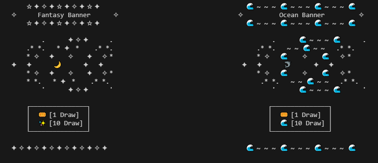

# Generic Gacha Game



## Overview

Generic Gacha Game is a very simple command line gacha game. It has things you would expect in a gacha game like character banners and only 1 and 10 draw options. There are some guides in the game itself, so no need to read through everything. There is an inventory system to keep track of characters, however, the current implementation of it only let's you see how many characters you have for each rarity. The luck battle is the only battle here right now. It is just a luck comparison to your opponent.

## Installation

1. Clone the repository into your machine:
    ```sh
    git clone https://github.com/WTCSC/socket-to-em-hi.git
    cd Socket-To-Em-Hi
    ```

## Usage

### Running the Server

1. Start the server:
    ```sh
    python server.py
    ```

2. Enter the port number you want to use when prompted (it is recommended to use anything over 1024).

### Running the Client

1. Start the client:
    ```sh
    python client.py
    ```

2. Enter the server's IP address and port number when prompted.

## How to Play

1. **Character Banner**: Choose a banner and summon characters using 1 or 10 draws.
2. **Banner Details**: View detailed information about the available banners.
3. **Game Guide**: Read the game guide to understand how to play the game.
4. **Battle**: Engage in Luck Battles to compare your luck to others.
5. **Inventory**: View your the amount of character you have for each rarity.
6. **Exit**: Exit the game.

## Game Mechanics

### Summoning Characters

- **1 Draw**: Summon one character at a time.
- **10 Draws**: Summon ten characters at a time.

### Character Rarity

- **5-Star Characters**: Highest rarity characters. (0.5%)
- **4-Star Characters**: Mid-tier rarity characters. (9.5%)
- **3-Star Characters**: Common rarity characters. (90%)

### Points System

- **5-Star Characters**: 100 points each.
- **4-Star Characters**: 6 points each.
- **3-Star Characters**: 2 points each.

### Luck Battle

- Compare your total points with the each other. The one with the highest point total wins.

## Future Plans
These are future mechanics to implement if I am not lazy.

- **Strategy Battle**: This was going to be the main battle option, but had to scale this game down for time. It was going to be a turn-based game with actual stats and special attacks. You can see the attributes I originally planned for in gacha.py.

- **Weapons**: Originally, there were going to be weapons that added attack and gave extra bonuses if they were used on a certain character, but this was removed since strategy battles were cut.